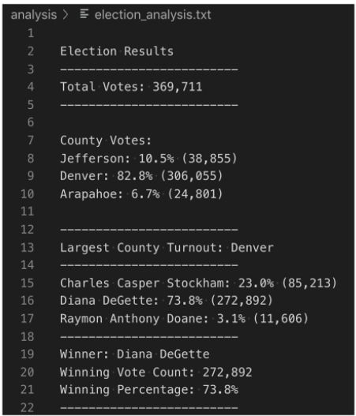
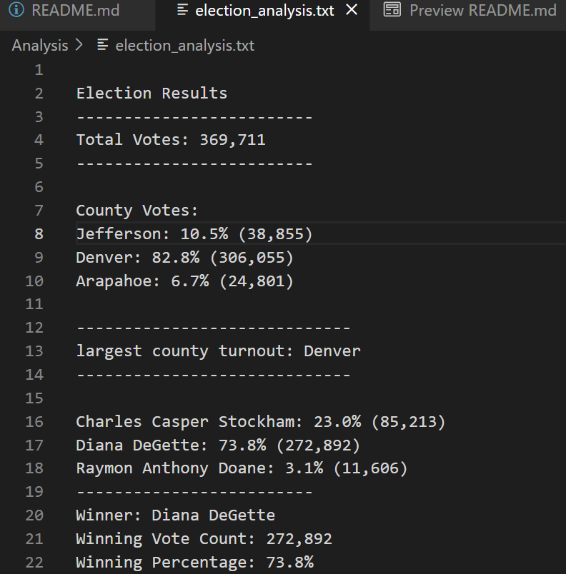

# PyPoll_Challenge_Starter_Code
Python Challenge (Module 3)

# Overview of Project
A Colorado Board of Elections has requested to complete the election audit of a recent local congressional election.

1. Calculate the total number of votes cast.
2. Get a complete list of candidates who received votes.
3. Calculate the total number of votes each candidate received.
4. Calculate the total number of votes each candidate received.
5. Calculate the percentage of votes each candidate won.
6. Determine the winner of the election based on popular vote.

# Resources
* Data Source: election_results.csv
* Software: Python 3.7.6, Visual Studio 1.61.2

* How many votes were cast in this election?
    - Total_Votes: 369,711

## Results as recorded in my election_analysis.txt file

## Deliverable 3: Analysis of the Election Audit

### Election-Audit Results:
> ***County Votes:***

> - **Jefferson** county has `10.5%` total percentage with a total votes of **38,855**
> - **Denver** county has the `82.8%` total percentage with a total votes of **306,055**
> - **Arapahoe** county has `6.7%` total percentage with a total votes of **24,801**

> ***County with Largest Number of Votes:***

> - **Denver** county has the largest number total of **306,055**
> - In addition, **Denver** county has the total votes percentage of `82.8%`  
> - **Denver** county is the Largest County Turnout

> ***Candidate Percentage of Votes:***
> - **Charles Casper Stockham** candidate has `23.0%` total percentage with a total votes of **85,213**
> - **Diana DeGette** candidate has the `73.8%` total percentage with a total votes of **272,892**
> - **Raymon Anthony Doane** candidate has `3.1%` total percentage with a total votes of **11,606**

> ***Election Results:***
> - **Diana DeGette** won the election, with a total votes of **272,892**
> - In addition, **Diana DeGette** has the total percentage votes of `73.8%
> - **Diana DeGette** is the Winner

